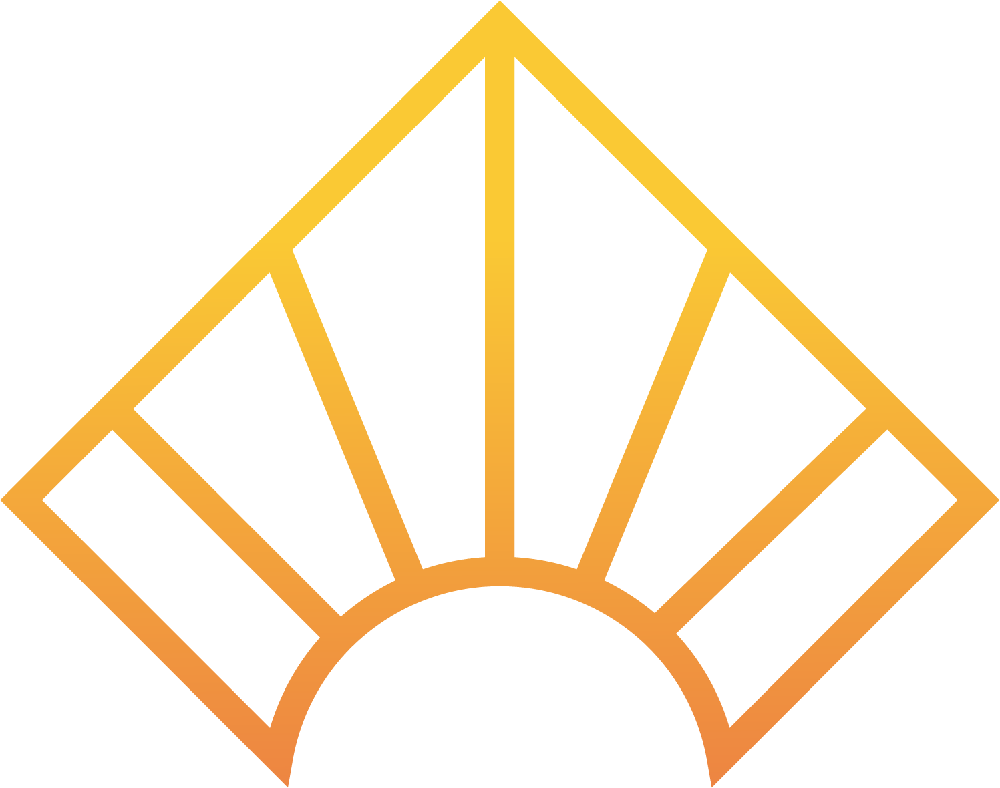

[![Contributors][contributors-shield]][contributors-url] [![Forks][forks-shield]][forks-url] [![Stargazers][stars-shield]][stars-url] [![Issues][issues-shield]][issues-url]

<!-- PROJECT LOGO -->
 

  
  <h1 align="center">Transferring the Sunlight Using Fiber Optical Cables</h1>
  

    Marmara University Deparment of Electrical and Electronics, Tubitak 2209-A Supported Graduation Project/Thesis
     
    <a href="https://youtu.be/0TlZ10MsEyc">Watch Commentary Video</a>
    ·
    <a href="https://youtu.be/4VCTo--MlWs">Watch Non-Comment Video</a>
    ·
    <a href="https://github.com/Yusufss4/Academy2021/issues">Request Feature</a>
  

   

    Index
     
    <a href="#The-Problem">The Problem</a>
    ·
    <a href="#The-Solution">The Solution</a>
    ·
    <a href="#Documents-Reports">Documentations</a>
  

# The Problem

With the increased population in mega cities architects had to design denser and bigger and taller buildings to supply this increased population accessing the healthy sunlight is getting harder and harder. The working hours, the traffic puts a heavy burden our health limits our accessibility to sun. The Vitamin D market is bigger more than ever an in the statistics coming from the UK %74 of the people has levels below the optimum level for wellbeing and %27 of have insufficient or deficient levels of Vitamin D. This shows us a very big and increasing problem. We cannot access the sunlight enough. 

We cannot change how we work. We cannot decrease the population, or we can’t make the buildings so that every room and every floor take enough light. So, what can we do so that people get enough sunlight? To fix this problem and increase our health and decrease the energy use we should find a solution to transfer the sunlight.

# The Solution

The solution is that transferring the sunlight using fiber optic cables. To make this first we have to gather the enough sunlight using specially made lenses. Because of the sun is moving and our circadian rhythm is designed according the to sunlight we must catch the sunlight somehow. That is, we should use sun tracker mechanism to track the sun so that we can deliver the daylight into the unlit places of buildings. 

Later when we gathered the sun to transfer the sun, we can use fiber optic cables. These cables are made for transferring the light so they should be capable of transferring the sunlight itself. And at the end of the cable with the light point and LED combination the balance between artificial lighting and natural light can be implemented. This balance will decrease the unnecessary energy use especially in the offices where the light is open day and night. While doing the transfer the user or the manufacturer will be able to monitor their system 7/24 to understand if there is a problem about it.

## Overview

### Concept of Operation

 
 

### Subsystems

 
 

 
## Mechanical Subsystem
### 3D Printed

 
 

### Render

 

### Pan-Tilt Mechanism

## Embedded Software
### Software State Diagram

 
  

### Sun Tracking Algorithm Diagram

 

## High-Level Software
### Server-Side Diagram

 
 

### Connection Diagram

 
 

### Interface

## Electrical Subsystem

### Electrical System

### Schematic

 
 

 
# Documents - Reports
## Thesis
<a href="https://github.com/Yusufss4/Academy2021/issues">Link</a>
<a href="https://github.com/Yusufss4/Academy2021/issues">ResearchGate</a>

## Presentation
<a href="https://github.com/Yusufss4/Academy2021/issues">Link</a>

<!-- MARKDOWN LINKS & IMAGES -->
<!-- https://www.markdownguide.org/basic-syntax/#reference-style-links -->
[contributors-shield]: https://img.shields.io/github/contributors/Yusufss4/Academy2021.svg?style=for-the-badge
[contributors-url]: https://github.com/Yusufss4/Academy2021/graphs/contributors
[forks-shield]: https://img.shields.io/github/forks/Yusufss4/Academy2021.svg?style=for-the-badge
[forks-url]: https://github.com/Yusufss4/Academy2021/network/members
[stars-shield]: https://img.shields.io/github/stars/Yusufss4/Academy2021.svg?style=for-the-badge
[stars-url]: https://github.com/Yusufss4/Academy2021/stargazers
[issues-shield]: https://img.shields.io/github/issues/Yusufss4/Academy2021.svg?style=for-the-badge
[issues-url]: https://github.com/Yusufss4/Academy2021/issues
[license-shield]: https://img.shields.io/github/license/Yusufss4/Academy2021.svg?style=for-the-badge
[license-url]: https://github.com/Yusufss4/Academy2021/blob/master/LICENSE.txt
[linkedin-shield]: https://img.shields.io/badge/-LinkedIn-black.svg?style=for-the-badge&logo=linkedin&colorB=555
[linkedin-url]: https://linkedin.com/in/yusufss
[product-screenshot]: images/screenshot.png
